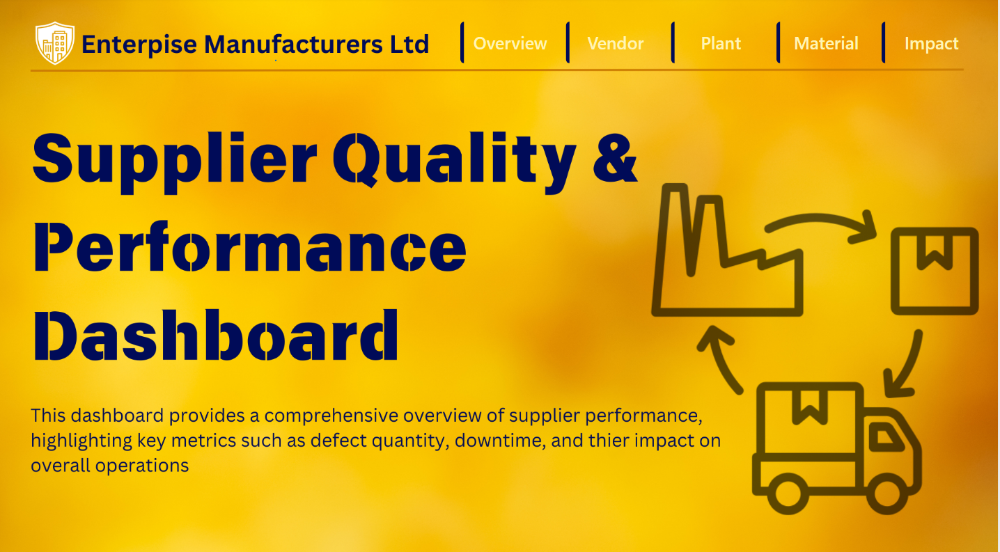
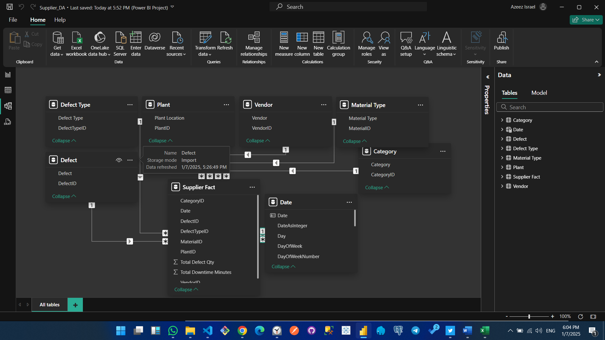
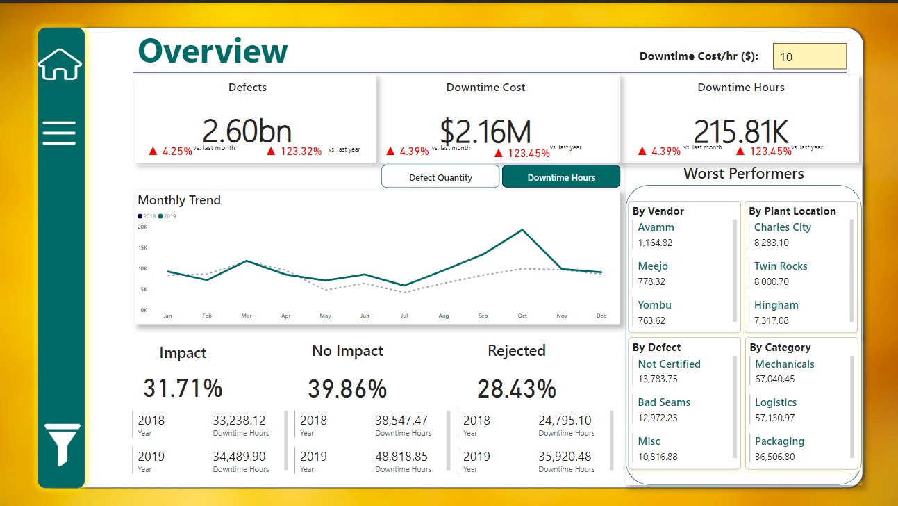
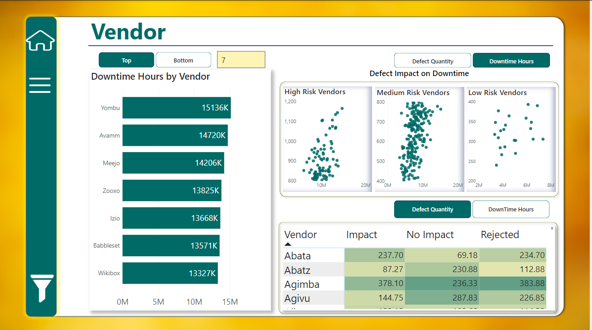
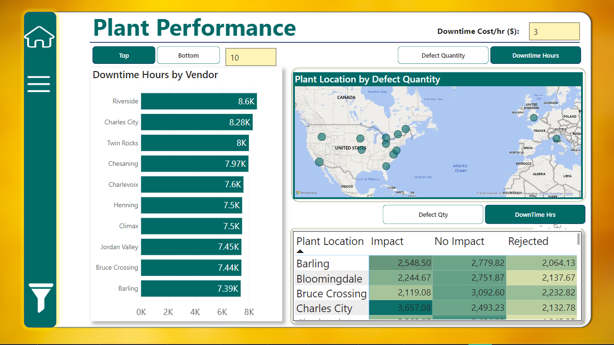
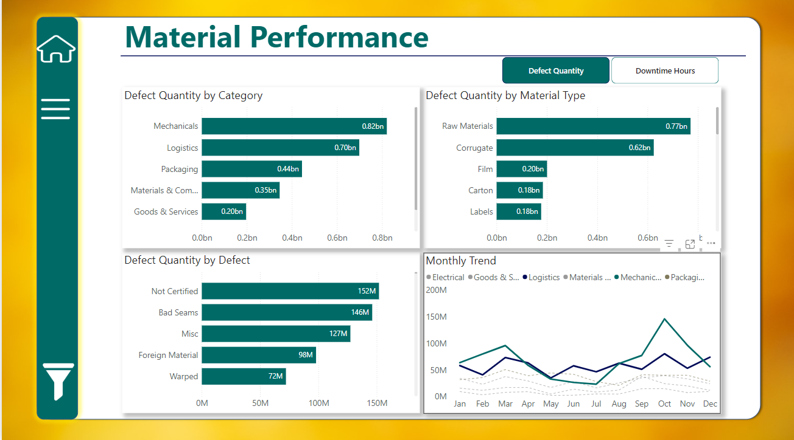
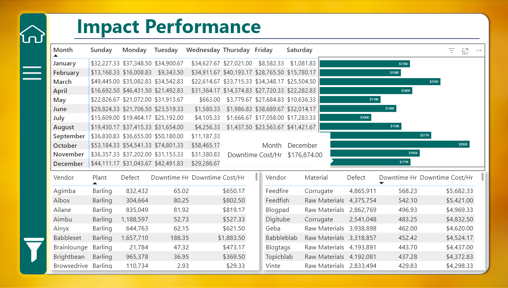

---

# Supplier Quality Analysis - Enterprise Manufacturers Ltd

## 1. Title
**Supplier Quality Analysis and Downtime Insights**

---

## 2. Introduction
Enterprise Manufacturers Ltd operates across multiple plants and sources raw materials from several vendors. However, the organization faces challenges due to the lack of a centralized procurement system, leading to inconsistencies in supplier quality and plant operations.

The management team has provided consolidated data on vendors, materials, and defects to address these issues. This project focuses on analyzing the data to uncover insights about supplier quality and operational inefficiencies, helping the organization adopt data-driven decisions.

---

## 3. About the Data
The data provided by the management team includes:
- **Vendor Details**: Information on vendors supplying raw materials.
- **Material Details**: Types of raw materials purchased.
- **Defect Data**: Number of defective materials.
- **Downtime Data**: Minutes of downtime caused by defective materials.
- **Plant Information**: Data from multiple plants.

The dataset was received in `.csv` format and underwent data cleaning, transformation, and modeling in **Power BI**.

---

## 4. Methodology

### 4.1 Data Collection
The data was collected from multiple plants, consolidating vendor and material defect details. The format provided was `.csv`.

### 4.2 Data Cleaning & Transformation
The dataset underwent cleaning using Power BI to:
- Handle missing or inconsistent data.
- Ensure column names were uniform.
- Create relationships between tables for analysis.

### 4.3 Exploratory Data Analysis
Preliminary analysis was performed to identify:
- High-defect vendors and materials.
- Plants experiencing the most downtime.

### 4.4 Visualization
Visuals were created in **Power BI** to present key metrics, trends, and patterns effectively.

### 4.5 Statistical Analysis
Quantitative analysis was performed to:
- Rank vendors and plants by defects and downtime.
- Identify poorly performing vendor-material combinations.

### 4.6 Interpretation & Recommendations
Insights from the analysis were summarized to provide actionable recommendations to management.

---

## 5. Data Structure Image

---

## 6. Data Model Overview
The data model was built in Power BI, comprising the following tables:
- **Supplier Fact Table**: Contains metrics such as total defects and downtime minutes.
- **Dimension Tables**:
  - **Vendor**: Vendor details.
  - **Material Type**: Types of raw materials.
  - **Plant**: Plant locations.
  - **Defect Type**: Categories of defects.
  - **Date**: Time dimension for analysis.

The relationships between tables were structured as a star schema to optimize performance.

---

## 7. Analysis

### Key Business Questions:
1. **Which vendors/plants are causing the greatest defect quantity?**
   - Vendors and plants with the highest defect counts were identified.
   
2. **Which vendors/plants are causing the greatest downtime?**
   - Analysis pinpointed vendors and plants responsible for the most downtime.

3. **Is there a combination of material and vendor that performs poorly?**
   - Material-vendor combinations with high defect counts were flagged.

4. **Is there a combination of vendor and plant that performs poorly?**
   - Vendor-plant combinations were analyzed for poor performance.

5. **How does the same vendor and material perform across different plants?**
   - Vendor-material performance was compared across plants.

---

## 8. Dashboards
### Overview

### Vendor Performance

### Plant Performance

### Material-Vendor Performance

### Impact of Defects on Downtime

---

## 9. Insights

### Key Findings:
- **Top Vendors by Defects**: [Example: Vendor A, Vendor B, etc.]
- **Top Plants by Downtime**: [Example: Plant X, Plant Y, etc.]
- **High-Risk Material-Vendor Combinations**: [Example: Material M with Vendor V.]
- **Poor Vendor-Plant Performance**: Vendors that perform poorly in specific plants.
- **Consistency Issues**: Variation in vendor-material performance across plants.

---

## 10. Recommendations

### Actionable Steps:
1. **Focus on High-Defect Vendors**:
   - Engage with vendors causing significant defects to address quality issues.
2. **Improve Plant Operations**:
   - Review processes in plants experiencing high downtime.
3. **Optimize Vendor-Material Relationships**:
   - Reassess partnerships for materials consistently performing poorly.
4. **Standardize Procurement Practices**:
   - Centralize procurement to ensure uniform vendor evaluation and material quality.
5. **Implement Continuous Monitoring**:
   - Use Power BI dashboards to track performance regularly.

---

[check on Power Bi Service](https://app.powerbi.com/groups/me/reports/94691d07-bd05-46e3-b7d9-8b75cf4e629f/21a742f311e4f6eec909?experience=power-bi)

<!-- markdown url -->

